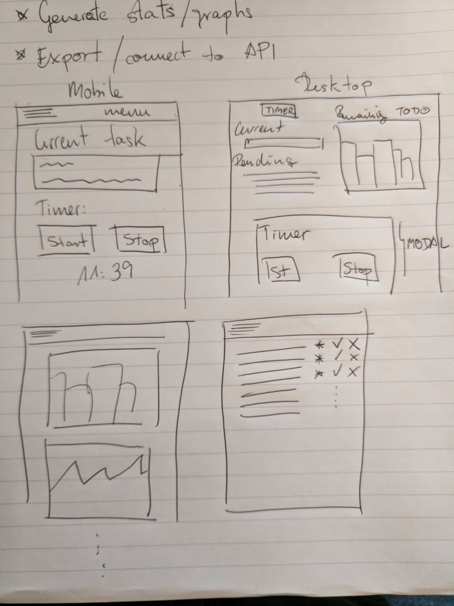
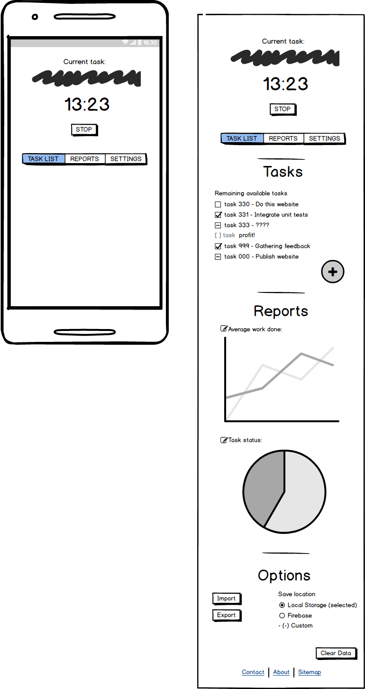
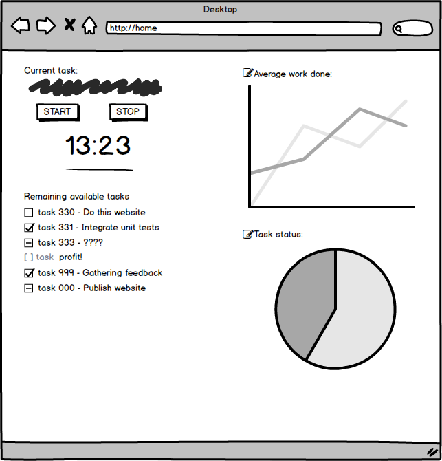
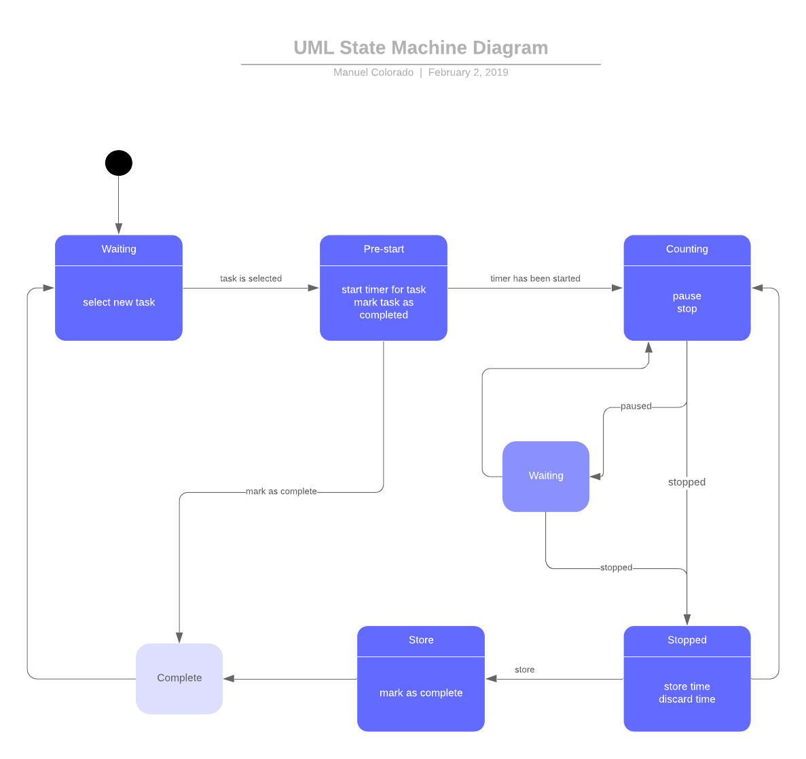
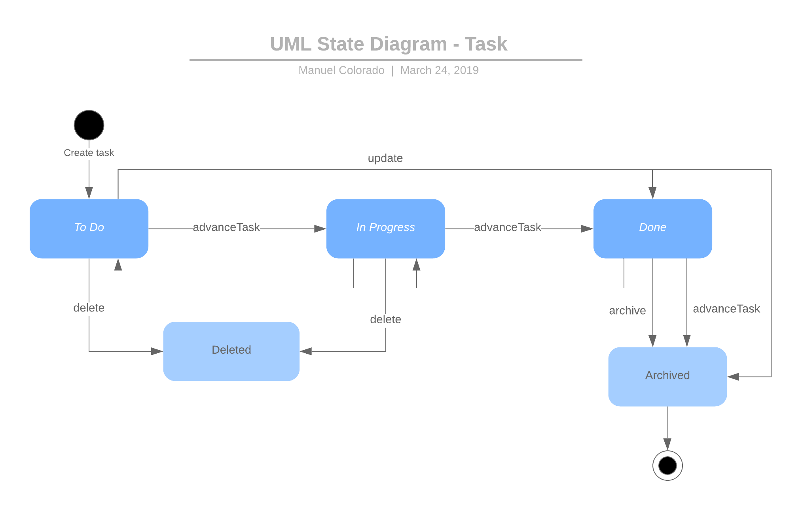

# Timesheet Helper

  

As per my daily job, we're required to track the time we invest in each assigned task and upload weekly to an Excel summary provided by management. It is very easy to forget when did you started each task, the exact amount of time invested, hard to manage when you're multitasking two or more tasks, etc...

This causes, not only frustration to the employee but also to management, as they cannot trust the values they're gathering as they're not 100% accurate.

This project attempts to solve this problem by also providing the end-user a better way to self-manage work and rest times by using the famous [Pomodoro technique](https://en.wikipedia.org/wiki/Pomodoro_Technique), if he or she wishes to abide to it.

## Update August 2019

This project was initially designed to be my User Centric project however as I started developing I realized that it was getting too much out of scope so I decided to leave it on the shelf as my project to be for the data centric project. I didn't know at that time that the project example that Code Institute will provide is also a task manager application.

However, after discussing this with my mentor, we've considered this to be complex enough as follows:

- The original project was server side rendered with Flask as render engine. This project uses Flask as the data access layer piece providing RESTful APIs that will be consumed by a frontend app.
- The original app is not a Single Page Application and needs to re-render on each user action. This application use ReactiveX module to handle state changes and provide a seemless experience to the user without navigating away.
- This application implements unit testing in both frontend and backend, using standard libraries for both system so the final product is more resilient to code changes.

I've noted sections that belong to the old project and are no longer relevant, to keep track of them so the reviewer can check the improvements upon the spec, if he or she wishes to do so.

## UX

The intended audience of this website is a person who is going to be doing a job that can be separated into tasks and where time needs to be tracked, either for management request, or to ensure the user that enough breaks are taken for both content assimilation or avoiding interrumptions.

An example of such tasks are:

    - Software Development
    - Studying
    - Physical work
    - Exercising
    - House chores
    - ...

By adding a mobile-first design approach we allow the user to not have to rely in a computer to track the time and remaining tasks to do.

### User Stories

#### Must Haves

- As a user, I want to be able to store the application data, so time and task completion are not lost after the web is closed. (**\*New\*** This used to be a should have requirement and has been moved to an important part of the features)
- As a user, I want to be able to start and stop the timer, so that I can track the time spent on each task assigned.
- As a user, I want to be able to record tasks in the app, so that I can better organize my time an plan ahead.
- As a user, I want to be able to choose the type of timer between Pomodoro timer and regular timer so I can pick the best that suit my needs regarding the task at hand.
- As a user, I want to be able to change the state of the tasks, so that I can mark those that I complete and tag those that were not completed with some useful information.

#### Should haves

- As a user, I want to be able to visualize a summary of the time spent using a variety of charts, so that I can have a better picture of the time spent for my own records or for management reporting.

#### Could haves

- As a user, I want to be able to import multiple tasks from a file or a structured string format, so I don't spend too much time adding new tasks to the system.
- As a user, I want to be able to export the data of the application, so I can use it in different applications or send it as a report to my supervisors.

#### Won't haves

- At this point further API integration is out of scope. In the future, it would be great if this can be integrated with other task management tools like Trello, project management tools like JIRA or even software development tools like Github or Visual Studio.

---

### Mockups and Diagrams

Initial Paper Mockup:

Basic Wireframe Setup for Mobile view and Desktop View

State Machine for Timer Functionality

State Machine for Task Status

## Features

### Existing Features

- Task Manager: Allows the user to track the status of his workload by creating, updating and progressing the tasks assigned to him
- Timer: Allows the user to start and stop a timer to check the time spent on a certain task. This timer can later be added to a task to keep track of how long each tasks takes.
- Settings: Allows the user to configure the settings of his application.
- Reports: Gives you a bit of insight in how you're doing in terms of productivity and efficiency.

### Features Left to Implement

- Possibility to switch between different forms of storage i.e. LocalStorage, Filesystem, Azure Blobs, Firebase, etc... The data layer interface can be used for these implementations into angular services, and then, the user could choose to inject one service or another.
- Import and Export the data from/to CSV or tabulated format to be reused on other applications like Excel.
- Connectivity to other apps to provide notifications, statistics or any other form of app integration.

## Technologies Used

### Libraries

#### Frontend

- This project's frontend was scaffolded by [Angular CLI](https://github.com/angular/angular-cli) version 8.0.2 which installs the following technologies (among others):
  - [rxjs](https://github.com/ReactiveX/rxjs): Introduces the concept of reactive programming and observables with the ReactiveX library.
  - [Typescript](https://www.npmjs.com/package/typescript): Adds typing and additional constructs not present on the JavaScript language but common to other languages to increase resilience to your code.
  - [Jasmine](https://jasmine.github.io/) and [Karma](https://www.npmjs.com/package/karma) for testing
  - The angular cli tooling itself which provides compilation, bundling and minification of the JavaScript code, as well as support to older browsers via Polyfills.
  - [Angular Material](https://material.angular.io/) was used for styling and providing page structure and responsiveness as well as a common theme.
- [Highcharts](https://www.highcharts.com/) library for generating graphs and plotting data.
- [FontAwesome](https://fontawesome.com/) library to get scalable svg icons to be used throughout the app.

#### Backend

**\*New\*** No backend was designed at the start of the project as it used to be an optional requirement

- Python [Flask](https://palletsprojects.com/p/flask/) and [PyMongo](https://api.mongodb.com/python/current/) libraries have been used to provide a suitable backend in the form of a RESTful API.
- Python [Unittest](https://docs.python.org/3/library/unittest.html) was used for testing purposes on the python code.
- [Postman](https://www.getpostman.com/) and [Postmanerator by Aurélien Baumann](https://github.com/aubm/postmanerator) to test and generate the API documentation

The full API documentation can be found in the [Postman public repository](https://documenter.getpostman.com/view/441248/SVfRuTtc?version=latest).

### Other tools

- This project has been created using [Visual Studio Code](https://code.visualstudio.com/) IDE in a [Node v.10.13](https://nodejs.org/en/) environment
- Project organization and task management provided by [GitHub and GitHub Projects](https://github.com).
  - All feature branchs within a sprint are squashed and merged into their respective sprint. Each sprint is Squashed and Merged into the master branch. Each Github issue and pull request still retain the history of commits against the branch or feature. Non-sprint branches are deleted after merge.
- Continuous Integration/Development automation provided by [Travis CI](http://travis-ci.com) and [Github Actions](https://github.com/features/actions).
- [Heroku](https://www.heroku.com/) is used to host the data layer in form of a RESTful API and provide Continuous Delivery **\*New\***.
- [MongoDB Atlas](https://www.mongodb.com/cloud/atlas) is our database provider **\*New\***.
- Code quality and analysis provided by [SonarQube](https://www.sonarqube.org/) via its cloud service [SonarCloud](https://sonarcloud.io/)
- [Snyk](https://snyk.io/) is used to analyze vulnerabilities within dependencies.

Click on the badges at the top of this file to check the build status and quality metrics.

## Testing

Most of the services have been automated although due to the complexity nature of the application getting a high code coverage proved to be out of scope and will leave it for a future learning experience. The UI interaction is not automated, please follow the Test Cases described in the appropriate section.

### Running automated unit tests

#### Frontend automated tests

Run `npm run test` to obtain a report of the tests with the no-watch option enabled.

The command `ng test` is also available just to execute the unit tests via [Karma](https://karma-runner.github.io) with the watch option enabled, useful for development purposes.

A Code Coverage report is also available in [SonarCloud](https://sonarcloud.io/component_measures?id=Narshe1412_Code-Institute-Data-Centric-Project&metric=coverage&view=list)

##### Backend automated tests

The file `test_app.py` can be run with any test runners for Python. If none is available, executing the command with `python test_app.py` will also run the tests, however, some of the test data will be committed to the database as a result.

### Manual Testing

A [detailed Test Plan](docs/test-cases.md) can be found in the following [link](docs/test-cases.md)

### Challenges while testing

A strange bug surfaced while testing using the Angular TestBed suites. In this case, while running the tests in Travis, I will often get `compile FAILED Uncaught [object Object] thrown` error which never happens in local and does not cause any issues with the application.
I spent several days debugging it and was unable to find the source. In the end, as this is something that only affects the testing suite I've decided to leave it in the backlog. Rerunning the CI script will often autorecover from this bug.

### Browser Compatibility

The application should be compatible with the latest versions in all browsers thanks to the use of polyfills. There are some fields that behave erratically in Internet Explorer but the application is functional despite these graphic issues

| Vendor            | Version       | Compatibility status                           |
| ----------------- | ------------- | ---------------------------------------------- |
| Google Chrome     | 76.0.3809.132 | Fully Compatible                               |
| Mozilla Firefox   | 68.0.1        | Fully Compatible                               |
| Microsoft Edge    | 42.17134.1.0  | Fully Compatible                               |
| Internet Explorer | 11.950.17134  | Functional, with some visual errors due to CSS |

## Deployment

This project was created using the Angular CLI which implements webpack under the hood to bundle all the files and create several JS files that contain the whole project structure.

I used TravisCI to automate the deployment process. On each push and pull request, Travis will create a container where it will do a fresh deployment of my app, run all the tests, create a production build and deploy it to the gh-pages branch. This is all configured on the file `.travis.yml`.

**\*New\*** The backend is provided by Heroku. I have a different [github repository](https://github.com/Narshe1412/Code-Institute-Data-Centric-Backend) where all the backend is implemented connected to Heroku. On each push, Github will analyze my tests and if they pass Heroku will pick up the build and deploy it as a separate server. Heroku has internally configured a set of environment variables where all the secrets are stored (i.e. the database user, password and connection string). The YML script to automate this can be found in the `.github\workflows\` folder in that repository.
This repository has been included as Git submodule so it's also present as reference on this project.

### Local Deployment

#### Frontend deployment

_Requirements_: Node 10.6 and NPM

In order to run your project locally just do:

`npm install`

`npm start`

This will run the project in **development mode**. To get a production build after `npm install` run:

`npm run build`

Further configuration can be done in terms of building and deploying. See the [Angular Documentation](https://angular.io/) for more details.

#### Backend deployment

**\*New\*** No backend was designed at the start of the project as it used to be an optional requirement

_Requirements_: Python 3.6 or higher. Python 2.7

_Before start_: As this code is included by using submodules, it requires to be pulled via command `git submodule update --init --recursive`. The code shall be available in the folder _Code-Institute-Data-Centric-Backend_

To setup the backend first of all a MONGO_URI string must be provided, either as a Environment Variable (recommended) or by updating the line `app.config["MONGO_URI"] = os.environ.get("MONGO_URI")` with the required string. A database named `data_driven` must be present to work.

Then navigate to the folder and execute `python app.py`

## Credits

### Acknowledgements

- The CORS implementation provided by the backend was suggested by Zhangqy in this [Stackoverflow post](https://stackoverflow.com/a/45818284/5866637)
- To implement the testing on the backend I followed this [tutorial by kenya-tech](https://kenya-tech.com/2019/01/18/writing-tests-for-a-restful-api-flask-app/)
- The timer implementation with observables was done following a [tutorial by Wojciech Trawiński in his Medium blog](https://medium.com/js-in-action/rxjs-pause-and-resume-mighty-switchmap-41d0d1fe1113) and adapted to the current needs of the application.
